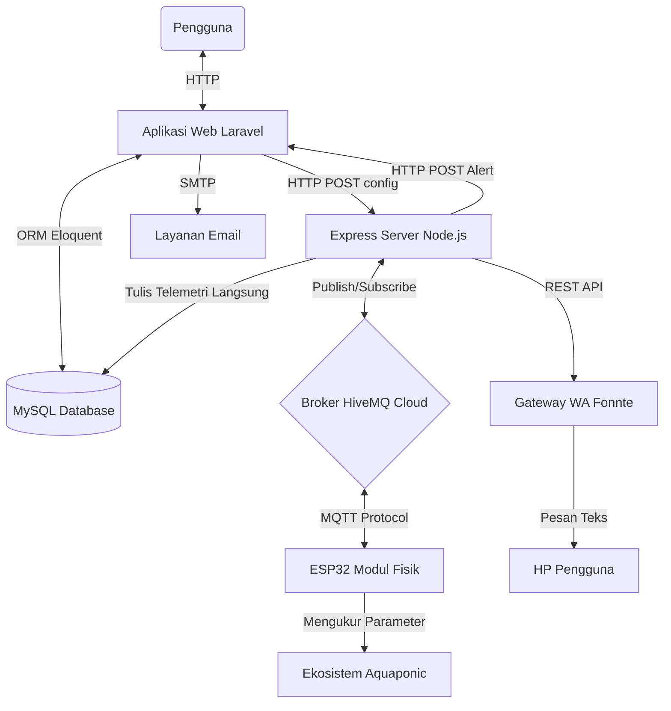

# Smart Aquaponic Management System

Dokumentasi ini ditujukan sebagai panduan teknis bagi software engineer yang akan memelihara, mengembangkan, atau melakukan refaktorisasi pada sistem pengelolaan Smart Aquaponic.

---

## 1. Gambaran Proyek

### Tujuan Aplikasi
Sistem **Smart Aquaponic** dirancang untuk melakukan pemantauan (*monitoring*) parameter telemetri lingkungan aquaponic secara *real-time* serta mengontrol aktuator (pompa, lampu penumbuh tanaman, pemberi pakan otomatis, aerator) baik secara terjadwal maupun manual melalui antarmuka web. Hal ini meminimalkan intervensi manual dan menjaga stabilitas ekosistem aquaponic demi meningkatkan produktivitas hasil budidaya ikan dan tanaman.

### Teknologi yang Digunakan
Sistem ini menggunakan arsitektur layanan ganda (*dual-service*) yang terdiri dari aplikasi web utama (backend & frontend) dan layanan penghubung MQTT (*MQTT bridge*):

*   **Aplikasi Web Utama (Laravel Stack)**:
    *   **Core**: Laravel 11.x (PHP 8.2+)
    *   **Frontend**: Tailwind CSS (styling), Alpine.js (interaksi UI/Client-side state), Vite (asset bundler)
    *   **Database**: MySQL/MariaDB (untuk data relasional)
*   **Layanan Penghubung (MQTT Listener & Bridge)**:
    *   **Core**: Node.js (Express & MQTT.js)
    *   **API Client**: Axios (untuk panggilan API balik ke Laravel)
    *   **Database Client**: `mysql2/promise` (koneksi langsung ke database MySQL untuk penulisan data performa tinggi)
*   **Protokol & Broker**:
    *   **Protokol**: MQTT (Message Queuing Telemetry Transport)
    *   **Broker**: HiveMQ Cloud (koneksi secure port `8883` dengan enkripsi TLS)
*   **Notifikasi & Integrasi**:
    *   **Email**: Laravel Mail (SMTP / `NotificationMail` template)
    *   **WhatsApp**: Integrasi gateway API Fonnte via HTTP request

### Arsitektur Singkat Aplikasi
Proyek ini mengadopsi pola arsitektur **hybrid-decoupled**. Laravel bertindak sebagai penyedia antarmuka konfigurasi, pengelolaan jadwal, visualisasi data analitik, dan autentikasi pengguna. Sementara itu, Node.js bertindak sebagai *middleware* jembatan (*bridge*) asinkron yang menangani aliran data sensor berkecepatan tinggi dari mikrokontroler (ESP32) ke database dan meneruskan perintah kontrol aktuator dari Laravel ke jaringan MQTT.

---

## 2. Cara Menjalankan Project

### Requirement
Sebelum menjalankan aplikasi, pastikan perangkat Anda telah terinstal:
*   PHP >= 8.2 (dengan ekstensi `pdo_mysql`, `curl`, `json`, `mbstring` aktif)
*   Composer >= 2.x
*   Node.js >= 18.x & NPM >= 9.x
*   MySQL Server / MariaDB Server
*   Akses ke Broker MQTT (HiveMQ Cloud / Broker MQTT Publik seperti Mosquitto)

---

### Instalasi & Setup

#### Langkah 1: Setup Proyek Utama (Laravel)
1. Buka terminal pada root direktori proyek.
2. Instal semua dependensi PHP dengan Composer:
   ```bash
   composer install
   ```
3. Instal dependensi frontend Node.js:
   ```bash
   npm install
   ```
4. Salin berkas konfigurasi `.env`:
   ```bash
   copy .env.example .env
   ```
5. Buka berkas `.env` dan konfigurasikan koneksi database Anda:
   ```env
   DB_CONNECTION=mysql
   DB_HOST=127.0.0.1
   DB_PORT=3306
   DB_DATABASE=nama_database_anda
   DB_USERNAME=root
   DB_PASSWORD=password_database_anda
   ```
6. Generate application key:
   ```bash
   php artisan key:generate
   ```
7. Jalankan migrasi database beserta data seeding awal (*seeder*):
   ```bash
   php artisan migrate --seed
   ```
   *Catatan Seeding*: Seeder akan membuat data dummy yang siap digunakan untuk login:
   *   **Akun Admin**: `admin@gmail.com` | Password: `password`
   *   **Akun User**: `budi.santoso@gmail.com` | Password: `password`

#### Langkah 2: Setup Layanan MQTT Bridge (Node.js)
1. Pindah ke direktori layanan MQTT listener:
   ```bash
   cd mqtt-listener
   ```
2. Instal dependensi Node.js:
   ```bash
   npm install
   ```
3. Salin berkas konfigurasi `.env`:
   ```bash
   copy .env.example .env
   ```
4. Sesuaikan konfigurasi koneksi database dan broker MQTT pada berkas `mqtt-listener/.env`:
   ```env
   DB_HOST=127.0.0.1
   DB_USER=root
   DB_PASSWORD=password_database_anda
   DB_NAME=nama_database_anda

   MQTT_URL=mqtts://BROKER_URL_ANDA:8883
   MQTT_USERNAME=USERNAME_MQTT_ANDA
   MQTT_PASSWORD=PASSWORD_MQTT_ANDA
   MQTT_TOPIC=aquaponic/device/data

   API_URL=http://127.0.0.1:8000/api/sensor-alert
   SENSOR_ALERT_SECRET=...
   FONTE_TOKEN=TOKEN_FONNTE_ANDA
   ```

---

### Menjalankan Project dalam Mode Pengembangan (Dev)

Kembali ke direktori root proyek (`d:\www-laravel\skripsi`), Anda dapat menjalankan proyek secara bersamaan (*concurrently*) menggunakan perintah *composer script* yang sudah disediakan di `composer.json`:

```bash
composer run dev
```

Perintah di atas akan menjalankan secara simultan:
1.  **Web Server Laravel**: di `http://127.0.0.1:8000`
2.  **Laravel Queue Listener**: memproses antrean email secara asinkron
3.  **Laravel Pail**: logging real-time di terminal
4.  **Vite Server**: melakukan kompilasi asset frontend (Tailwind) secara hot-reload

Untuk menjalankan **Node.js MQTT Bridge** (di terminal terpisah):
```bash
cd mqtt-listener
node app.js
```
Akan menjalankan server Node.js pada port `5000` (default) dan mulai mendengarkan pesan dari broker MQTT HiveMQ.

---

## 3. Struktur Folder

Berikut adalah penjelasan mengenai direktori penting dalam sistem ini:

```
skripsi/
├── app/                      # Logika utama aplikasi (Backend Laravel)
│   ├── Events/               # Event kelas (misal: SiteDevicesUpdated)
│   ├── Http/                 # Controller, Middleware, Request
│   │   ├── Controllers/      # Controller MVC utama untuk Web & API
│   │   └── Middleware/       # Middleware aplikasi (termasuk filter role pengguna)
│   ├── Listeners/            # Handler event (misal: SyncSiteDevicesToMqtt)
│   ├── Models/               # File Model Eloquent (Definisi skema & relasi tabel)
│   └── Services/             # Kelas layanan tambahan (MqttService untuk HTTP bridge client)
├── bootstrap/                # Konfigurasi bootstrap Laravel & Registrasi Middleware
├── config/                   # Semua berkas konfigurasi Laravel (app, database, services, dll)
├── database/                 # Berkas migrasi database, seeder, dan factory
├── mqtt-listener/            # Node.js MQTT listener & bridge service (Express App)
│   ├── app.js                # File utama Node.js bridge (MQTT handler, Fonnte WA, Express endpoints)
│   ├── listener.js           # Script legacy listener berbasis mysql2 non-promise
│   └── .env                  # Variabel lingkungan untuk Node.js service
├── public/                   # Asset statis publik (logo.png, dll)
├── resources/                # Source code frontend (CSS, Views Blade, JS)
│   ├── css/                  # File stylesheet CSS (app.css menggunakan Tailwind)
│   └── views/                # Template halaman HTML (Blade engine)
├── routes/                   # File definisi rute routing aplikasi
│   ├── api.php               # Rute API (diakses oleh Node.js bridge / pihak luar)
│   └── web.php               # Rute web utama (dashboard, kontrol, jadwal, admin panel)
└── vite.config.js            # Konfigurasi asset bundler Vite
```

---

## 4. Panduan Pengembangan

Gunakan tabel referensi berikut untuk mengetahui bagian kode mana yang harus Anda modifikasi ketika ingin menambah atau mengubah fungsionalitas sistem:

| Saya ingin mengubah... | File / Folder yang perlu diedit | Penjelasan |
| :--- | :--- | :--- |
| **Tampilan Halaman Login** | [login.blade.php](file:///d:/www-laravel/skripsi/resources/views/login.blade.php) | Mengedit tata letak dan UI form login |
| **Navbar & Sidebar Utama** | [app.blade.php](file:///d:/www-laravel/skripsi/resources/views/layouts/app.blade.php) | Navigasi menu navigasi untuk role admin & user (menggunakan Alpine.js) |
| **Logic Dashboard Admin/User** | [DashboardController.php](file:///d:/www-laravel/skripsi/app/Http/Controllers/DashboardController.php) | Perhitungan statistik, filter rentang waktu, dan pengambilan telemetri terkini |
| **Tampilan Dashboard User** | [user/dashboard.blade.php](file:///d:/www-laravel/skripsi/resources/views/user/dashboard.blade.php) | Widget telemetri, tabel sensor, dan visualisasi chart |
| **Chart Grafik Sensor** | [DashboardController.php](file:///d:/www-laravel/skripsi/app/Http/Controllers/DashboardController.php#L183) | Modifikasi data JSON endpoint `/chart-data` dan skema warna visualisasi |
| **Rute Aplikasi (Web/API)** | [routes/web.php](file:///d:/www-laravel/skripsi/routes/web.php) & [routes/api.php](file:///d:/www-laravel/skripsi/routes/api.php) | Pendaftaran endpoint routing baru |
| **Logika Autentikasi** | [AuthController.php](file:///d:/www-laravel/skripsi/app/Http/Controllers/AuthController.php) | Proses login, logout, dan pengecekan status akun (active/inactive) |
| **Kontrol Aktuator Manual** | [ActuatorControlController.php](file:///d:/www-laravel/skripsi/app/Http/Controllers/ActuatorControlController.php) | Aksi *toggle* ON/OFF dari web, pembuatan log, dan *trigger* ke MQTT bridge |
| **Penjadwalan Pakan (Feeder)**| [FeedScheduleController.php](file:///d:/www-laravel/skripsi/app/Http/Controllers/FeedScheduleController.php) | CRUD jadwal pakan, validasi overlap jadwal, dan sinkronisasi ke ESP32 |
| **Penjadwalan Grow Light** | [GrowLightScheduleController.php](file:///d:/www-laravel/skripsi/app/Http/Controllers/GrowLightScheduleController.php) | CRUD jadwal grow light (waktu mulai/selesai) dan sinkronisasi ke ESP32 |
| **Struktur Database (Tabel)** | [database/migrations/](file:///d:/www-laravel/skripsi/database/migrations) | Penambahan kolom, relasi tabel asing (*foreign keys*), atau pembuatan tabel baru |
| **Relasi & Model Data** | [app/Models/](file:///d:/www-laravel/skripsi/app/Models) | Modifikasi model Eloquent (relasi *HasMany*, *BelongsTo*, dsb.) |
| **Penghubung MQTT (Node.js)** | [mqtt-listener/app.js](file:///d:/www-laravel/skripsi/mqtt-listener/app.js) | Penanganan parsing payload JSON dari ESP32, integrasi webhook Fonnte WhatsApp |
| **Endpoint Webhook Alert** | [NotificationController.php](file:///d:/www-laravel/skripsi/app/Http/Controllers/NotificationController.php#L70) | Validasi secret token alert, penyimpanan notifikasi, dan trigger kirim email |
| **Desain Email Notifikasi** | [NotificationMail.php](file:///d:/www-laravel/skripsi/app/Mail/NotificationMail.php) & [emails/notification.blade.php](file:///d:/www-laravel/skripsi/resources/views/emails/notification.blade.php) | Template desain email alert yang dikirim ke user |

---

## 5. Penjelasan Alur Aplikasi

### A. Aliran Uplink (Penerimaan Data Telemetri Sensor)
Alur ini berjalan secara asinkron saat modul mikrokontroler (ESP32) mengirimkan data pembacaan sensor ke server:

```
[ESP32 Node]
     │ (Mengirim payload JSON data sensor via MQTT)
     ▼
[HiveMQ Cloud (Broker)] (Topik: aquaponic/device/data)
     │ (Pesan diterima oleh listener yang subscribe)
     ▼
[Node.js MQTT Bridge] (mqtt-listener/app.js)
     │
     ├─► [MySQL Database] (Tulis langsung ke tabel 'data_sensors' secara performan)
     │
     └─► [Ambangan Threshold Terlampaui?] 
              │ (Ya)
              ▼
         [Kirim HTTP POST Alert] (Headers: X-Sensor-Alert-Secret)
              │
              ▼
         [Laravel API] (/api/sensor-alert)
              │
              ├─► Simpan ke database 'notifications'
              ├─► Kirim Email (Laravel Mailables) ke User (jika diset aktif)
              └─► Kirim HTTP request ke gateway WA Fonnte untuk notifikasi seluler
```

---

### B. Aliran Downlink (Kontrol Aktuator & Sinkronisasi Jadwal)
Alur ini berjalan ketika pengguna berinteraksi dengan antarmuka web Laravel untuk mengontrol aktuator atau mengubah jadwal:

```
[User]
  │ (Klik tombol toggle Aktuator atau Simpan Jadwal baru pada halaman web)
  ▼
[Laravel Controller] (ActuatorControlController / FeedScheduleController)
  │
  ├─► Tulis perubahan status ke database 'actuator_logs' / 'feed_schedules'
  │
  └─► Jalankan MqttService::publishDeviceConfig($device)
        │
        ▼ (Mengirimkan payload HTTP POST konfigurasi perangkat lengkap)
        ▼ (URL: http://127.0.0.1:5000/publish-config)
  [Node.js Express App] (mqtt-listener/app.js)
        │
        ▼ (Publish pesan dengan flag RETAIN = TRUE ke broker MQTT)
        ▼ (Topik: aquaponic/device/{mac_address}/config)
  [HiveMQ Cloud (Broker)]
        │
        ▼ (Meneruskan pesan konfigurasi ter-retain ke modul perangkat)
  [ESP32 Node] (Memproses payload & mengubah status fisik relay/servo aktuator)
```

---

## 6. Penjelasan Setiap Fitur

### 1. Dashboard & Telemetri Real-time
*   **Lokasi**: [DashboardController.php](file:///d:/www-laravel/skripsi/app/Http/Controllers/DashboardController.php) & [user/dashboard.blade.php](file:///d:/www-laravel/skripsi/resources/views/user/dashboard.blade.php)
*   **Komponen Utama**: Chart.js (grafik garis telemetri), widget status sensor (merah jika abnormal, hijau jika normal).
*   **Logic Utama**:
    *   Metode `applyConnectionPeriodFilter` menyaring data sensor historis agar hanya menampilkan data di mana perangkat aktif terasosiasi dengan Site tertentu berdasarkan tabel pivot `site_devices` (menghindari kebocoran data antar site atau antar masa asosiasi perangkat).
    *   Metode `chartData` mengembalikan 15 titik data terbaru dalam format JSON untuk dirender ke Chart.
*   **File Berhubungan**:
    *   `app/Models/DataSensor.php`
    *   `app/Models/Sensor.php`
*   **Cara melakukan perubahan**:
    1. Untuk mengubah warna garis grafik sensor, edit variabel `$colors` di dalam `DashboardController::chartData` sesuai tipe sensornya.
    2. Untuk memperbanyak data yang tampil di grafik, ubah parameter `take(15)` pada query data points di `DashboardController::chartData` ke jumlah yang diinginkan.

### 2. Kontrol Aktuator Manual
*   **Lokasi**: [ActuatorControlController.php](file:///d:/www-laravel/skripsi/app/Http/Controllers/ActuatorControlController.php) & [actuator_control.blade.php](file:///d:/www-laravel/skripsi/resources/views/actuator_control.blade.php)
*   **Komponen Utama**: Toggle switch UI pada web user, representasi status fisik aktuator.
*   **Logic Utama**:
    *   User menekan tombol toggle aktuator -> Controller membuat record `ActuatorLog` baru dengan `triggered_by = 'manual'` dan mengubah status `action` (`on`/`off`).
    *   Panggilan static ke `MqttService::publishDeviceConfig($actuator->device)` dilakukan untuk memformat payload konfigurasi perangkat terbaru.
*   **File Berhubungan**:
    *   `app/Services/MqttService.php`
    *   `app/Models/ActuatorLog.php`
*   **Cara melakukan perubahan**:
    1. Jika ingin menambahkan tipe aktuator baru (misal: *heater*), daftarkan tipe tersebut di enum atau dokumentasi database, kemudian tambahkan ikon pendukung pada switch case layout `actuator_control.blade.php`.

### 3. Penjadwalan Pakan Otomatis
*   **Lokasi**: [FeedScheduleController.php](file:///d:/www-laravel/skripsi/app/Http/Controllers/FeedScheduleController.php) & [jadwal_pakan/index.blade.php](file:///d:/www-laravel/skripsi/resources/views/jadwal_pakan/index.blade.php)
*   **Komponen Utama**: Form tambah/edit jadwal pakan (Waktu & Durasi dalam menit).
*   **Logic Utama**:
    *   Fungsi `checkFeedOverlap` memvalidasi agar jadwal baru tidak bertabrakan dengan jadwal yang sudah ada untuk aktuator feeder yang sama. Validasi ini mendukung pembagian interval melintasi tengah malam (24:00).
    *   Setelah jadwal disimpan, `MqttService::publishDeviceConfig` dipanggil untuk memperbarui daftar jadwal pakan di memori ESP32 via MQTT.
*   **Cara melakukan perubahan**:
    1. Untuk mengubah batas maksimal durasi pakan (default: 60 menit), edit aturan validasi `'duration' => 'required|integer|min:1|max:60'` pada metode `store()` dan `update()` di `FeedScheduleController.php`.

### 4. Penjadwalan Grow Light
*   **Lokasi**: [GrowLightScheduleController.php](file:///d:/www-laravel/skripsi/app/Http/Controllers/GrowLightScheduleController.php) & [jadwal_grow_light/index.blade.php](file:///d:/www-laravel/skripsi/resources/views/jadwal_grow_light/index.blade.php)
*   **Komponen Utama**: Form manajemen jadwal grow light (waktu mulai *start_time* dan waktu selesai *end_time*).
*   **Logic Utama**:
    *   Mirip dengan jadwal pakan, validasi overlap diaplikasikan untuk mencegah bentrokan rentang aktif lampu grow light.
    *   Data dikirim ke ESP32 dalam format JSON berstruktur array jadwal berisi waktu mulai dan selesai.
*   **File Berhubungan**:
    *   `app/Models/GrowLightSchedule.php`

### 5. Kelola Perangkat & Site (Sisi Admin)
*   **Lokasi**: [SiteController.php](file:///d:/www-laravel/skripsi/app/Http/Controllers/SiteController.php) & [SiteDeviceController.php](file:///d:/www-laravel/skripsi/app/Http/Controllers/SiteDeviceController.php)
*   **Komponen Utama**: Panel kontrol admin untuk mendaftarkan Site (lahan aquaponic), membuat akun User, serta menautkan Device (slave node) ke Site tertentu.
*   **Logic Utama**:
    *   `SiteDeviceService::attachDevice` mengubah status perangkat dari `available` ke `assigned` dan memicu event `SiteDevicesUpdated`.
    *   Event tersebut memicu listener `SyncSiteDevicesToMqtt` yang mempublikasikan daftar relasi slave terbaru ke master node menggunakan `MqttService::publishMasterSync`.

### 6. Sistem Alert & Notifikasi
*   **Lokasi**: [NotificationController.php](file:///d:/www-laravel/skripsi/app/Http/Controllers/NotificationController.php) & [Notification.php](file:///d:/www-laravel/skripsi/app/Models/Notification.php)
*   **Komponen Utama**: Mailer Laravel, integrasi REST API Fonnte WhatsApp, filter anti-spam 30 menit.
*   **Logic Utama**:
    *   Fungsi `sensorAlert` membatasi pengiriman alert berulang untuk site dan pesan yang identik dalam kurun waktu 30 menit (`created_at >= now()->subMinutes(30)`) guna mencegah spam notifikasi email dan WhatsApp ketika sensor berfluktuasi cepat di sekitar garis ambang batas (*threshold*).

---

## 7. Dependency Penting

### Backend (Laravel - composer.json)
*   `laravel/framework (^11.31)`: Framework PHP inti yang digunakan.
*   `laravel/sanctum (^4.0)`: Menyediakan sistem token API ringan untuk mengamankan komunikasi API eksternal jika diperlukan di masa depan.
*   `concurrently (^9.0.1 - dev)`: Digunakan di dalam script development NPM untuk menjalankan server PHP, Vite, antrean log, dan queue listener secara bersamaan dalam satu baris perintah terminal.

### MQTT Bridge (Node.js - package.json)
*   `mqtt (^5.x)`: Library MQTT client untuk menghubungkan, berlangganan topik telemetri, dan mempublikasikan payload konfigurasi perangkat.
*   `mysql2 (^3.x)`: Driver database MySQL berperforma tinggi yang mendukung antarmuka Promise (`mysql2/promise`) untuk melakukan operasi penulisan data sensor massal tanpa memblokir event-loop.
*   `axios (^1.x)`: HTTP Client untuk menembak endpoint webhook alert Laravel secara asinkron.
*   `express (^4.x)`: Web framework minimalis yang menyediakan API endpoint internal bagi Laravel (`/publish-config` & `/publish-master-sync`).

---

## 8. Environment Variable (.env)

### A. Konfigurasi Variabel di Root Laravel
| Kunci Variabel | Nilai Default / Contoh | Deskripsi |
| :--- | :--- | :--- |
| `APP_ENV` | `local` | Mode aplikasi (`local`/`production`) |
| `APP_KEY` | `base64:...` | Kunci enkripsi Laravel (sangat penting untuk keamanan sesi) |
| `DB_CONNECTION` | `mysql` | Driver database relasional yang digunakan |
| `DB_HOST` | `127.0.0.1` | Alamat IP atau hostname MySQL server |
| `DB_DATABASE` | `nama_database_anda` | Nama database yang digunakan |
| `SENSOR_ALERT_SECRET` | `buat-string-acak-min-32-karakter` | Token rahasia pengaman webhook API agar tidak ditembak sembarang entitas |
| `NODE_MQTT_API_URL` | `http://127.0.0.1:5000/publish-config` | Endpoint HTTP Node.js bridge untuk mempublish konfigurasi aktuator |
| `NODE_MQTT_SYNC_URL` | `http://127.0.0.1:5000/publish-master-sync` | Endpoint HTTP Node.js bridge untuk mempublish sinkronisasi master-slave |

### B. Konfigurasi Variabel di `mqtt-listener/.env`
| Kunci Variabel | Nilai Default / Contoh | Deskripsi |
| :--- | :--- | :--- |
| `DB_HOST` | `localhost` | Alamat database MySQL |
| `DB_USER` | `root` | Username MySQL |
| `DB_NAME` | `nama_database_anda` | Nama database target penyimpanan telemetri |
| `MQTT_URL` | `mqtts://URL_BROKER_ANDA:8883` | URI broker MQTT (gunakan `mqtts` jika menggunakan TLS pada port 8883) |
| `MQTT_TOPIC` | `aquaponic/device/data` | Topik utama di mana ESP32 mengirim data telemetri |
| `API_URL` | `http://127.0.0.1:8000/api/sensor-alert` | Endpoint balik ke Laravel untuk pendaftaran alert |
| `SENSOR_ALERT_SECRET` | `buat-string-acak-min-32-karakter` | Harus bernilai sama dengan `SENSOR_ALERT_SECRET` di Laravel |
| `FONTE_TOKEN` | `TOKEN_DARI_DASHBOARD_FONNTE` | Token otentikasi API Fonnte untuk pengiriman notifikasi WhatsApp |

---

## 9. Tips Developer

*   **Pentingnya Database Transaction**: Ketika menulis perubahan relasi perangkat pada `SiteDeviceService.php`, selalu bungkus proses dalam blok `DB::transaction`. Jika salah satu proses gagal (misalnya relasi tercatat tapi update status device gagal), database akan otomatis melakukan *rollback* untuk mencegah ketidaksinkronan data.
*   **Jangan Mengedit Nilai MQTT_URL secara Hardcode**: Hindari menulis kredensial HiveMQ langsung di file `mqtt-listener/app.js`. Gunakan selalu file `.env` lokal untuk mempermudah migrasi server dari lokal ke staging/production.
*   **Menambahkan Sensor Baru**: Jika ingin menambahkan sensor fisik baru (seperti sensor Oksigen Terlarut / *DO*):
    1. Daftarkan jenis sensor tersebut pada switch case parsing di file `mqtt-listener/app.js` (dalam bentuk huruf kecil).
    2. Daftarkan kode warnanya pada variabel `$colors` di `DashboardController.php` agar tampil di chart grafik dashboard.
*   **Masa Aktif Asosiasi Perangkat**: Sistem mencatat riwayat perpindahan perangkat. Pastikan untuk mengisi kolom `ended_at` dengan waktu sekarang pada tabel `site_devices` sebelum memindahkan slave device ke site lain agar data telemetri historis tidak tercampur.

---

## 10. FAQ Developer

**Q: Bagaimana cara mengubah logo aplikasi?**
**A**: Ganti file gambar `logo.png` yang terletak di direktori [public/logo.png](file:///d:/www-laravel/skripsi/public/logo.png). Ukuran gambar yang direkomendasikan adalah rasio persegi (misalnya 512x512 piksel).

**Q: Mengapa data sensor masuk ke database tetapi grafik dashboard kosong?**
**A**: Periksa kembali relasi perangkat Anda di halaman Admin. Pastikan *Device* yang mengirimkan data dengan MAC Address tersebut telah dihubungkan secara aktif ke *Site* pengguna, dan status asosiasi di tabel `site_devices` belum kedaluwarsa (`ended_at IS NULL`).

**Q: Bagaimana cara mengubah rentang waktu sensor agar notifikasi peringatan tidak terus menerus dikirim?**
**A**: Masuk sebagai Admin, pilih menu **Daftar Sensor**, lalu ubah batas minimum (`min_threshold`) dan batas maksimum (`max_threshold`) dari sensor yang bersangkutan.

**Q: Mengapa WhatsApp Notifikasi Fonnte tidak terkirim?**
**A**: Pastikan nilai `FONTE_TOKEN` di `mqtt-listener/.env` aktif dan nomor telepon penerima di tabel `users` memiliki format internasional (diawali dengan `62` atau `0`, karena program di Node.js otomatis memformat awalan `0` menjadi `62`).

---

## 11. Diagram Struktur Project

Berikut adalah skema visual pohon direktori proyek yang disederhanakan:

```
. (skripsi root)
├── app
│   ├── Http
│   │   └── Controllers
│   │       ├── ActuatorControlController.php
│   │       ├── DashboardController.php
│   │       ├── FeedScheduleController.php
│   │       ├── GrowLightScheduleController.php
│   │       └── NotificationController.php
│   ├── Models
│   │   ├── Actuator.php
│   │   ├── ActuatorLog.php
│   │   ├── DataSensor.php
│   │   ├── Device.php
│   │   ├── Notification.php
│   │   └── Sensor.php
│   └── Services
│       └── MqttService.php
├── database
│   ├── migrations
│   └── seeders
├── mqtt-listener
│   ├── app.js
│   ├── package.json
│   └── .env
├── resources
│   ├── css
│   └── views
│       ├── layouts
│       │   └── app.blade.php
│       ├── user
│       │   └── dashboard.blade.php
│       └── welcome.blade.php
└── routes
    ├── api.php
    └── web.php
```

---

## 12. Diagram Hubungan Antar Modul

Hubungan komunikasi antar modul sistem dapat divisualisasikan melalui diagram Mermaid berikut:



---

## 13. Catatan Maintenance

### Area dengan Tingkat Coupling Tinggi (High Coupling)
*   **Payload Konfigurasi MQTT**: Format JSON konfigurasi aktuator dan jadwal yang dihasilkan oleh [MqttService::publishDeviceConfig](file:///d:/www-laravel/skripsi/app/Services/MqttService.php#L19) di Laravel harus sama persis dengan struktur parsing JSON yang ditangani oleh mikrokontroler ESP32. Jika Anda memodifikasi nama kunci atau struktur array pada backend Laravel, kode program (*firmware*) ESP32 juga wajib diperbarui agar tidak terjadi *crash* parsing data di perangkat keras.

### Bagian Sensitif untuk Diubah
*   **Fungsi Penyaringan Rentang Asosiasi Perangkat (`applyConnectionPeriodFilter`)**: Logika SQL dinamis ini diterapkan pada `DashboardController`, `DataSensorController`, dan `ActuatorLogController`. Modifikasi minor pada struktur query filter ini dapat menyebabkan kebocoran data telemetri historis (misalnya data milik user lama terbaca oleh user baru yang memakai device bekas).

### Rekomendasi Refaktorisasi di Masa Depan
1.  **Konsolidasi Koneksi Database di Node.js**: Node.js MQTT listener saat ini terhubung langsung ke database MySQL menggunakan modul `mysql2/promise`. Jika di masa mendatang struktur tabel Laravel berubah, Anda harus memperbarui kode SQL mentah (*raw queries*) di `mqtt-listener/app.js`. Memigrasikan penulisan data telemetri dari Node.js langsung melalui API endpoint Laravel (seperti `/api/sensors`) akan membuat arsitektur lebih bersih dan ter-dekopol (*decoupled*), meski perlu mempertimbangkan beban latensi HTTP.
2.  **Pemisahan Server**: Layanan Node.js MQTT bridge sebaiknya dideploy sebagai microservice terpisah (misalnya menggunakan PM2 proses manager) agar apabila layanan web Laravel mengalami *crash* atau *downtime* saat perbaikan (*maintenance*), penangkapan data sensor dari lapangan oleh Node.js bridge tetap berjalan lancar.
